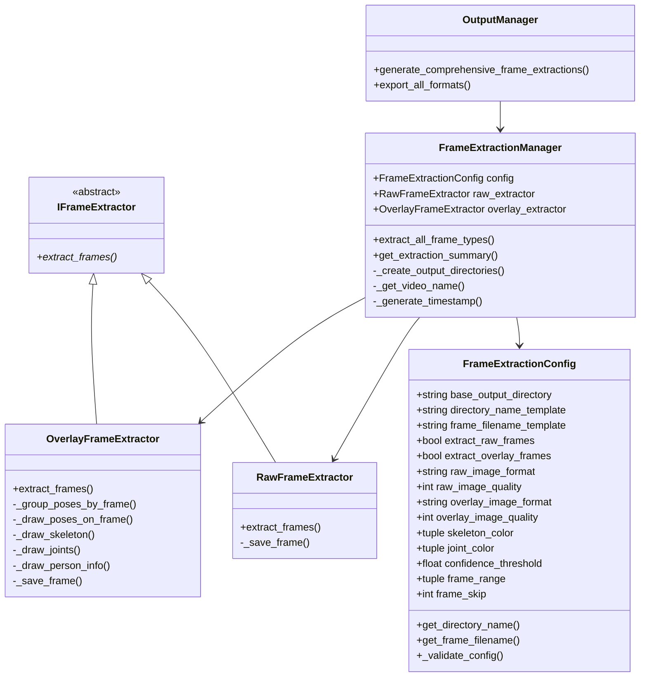

# Comprehensive Frame Extraction System Design

## 🎯 Overview

The Comprehensive Frame Extraction System is a modular, extensible solution that creates **two separate sets of frame outputs** from video files:

1. **Raw Frames**: Unprocessed video frames for research and analysis
2. **Overlay Frames**: Frames with pose annotations for presentation and debugging

## 🏗️ Architecture Design

### Core Principles

The design follows **SOLID principles** and **DRY methodology** with a focus on:
- **Modularity**: Each component has a single, well-defined responsibility
- **Extensibility**: Easy to add new extraction types or configurations
- **Scalability**: Handles videos of any size efficiently
- **Robustness**: Comprehensive error handling and validation

### Class Diagram



## 📋 Component Specifications

### 1. FrameExtractionConfig

**Purpose**: Centralized configuration for all frame extraction operations.

**Key Features**:
- **Validation**: Automatic validation of all parameters
- **Flexibility**: Supports different image formats, qualities, and processing settings
- **Template System**: Configurable naming patterns for directories and files

**Configuration Options**:
```python
config = FrameExtractionConfig(
    # Output organization
    base_output_directory="outputs",
    directory_name_template="{type}_{video_name}_{timestamp}",
    frame_filename_template="frame_{:05d}.{extension}",
    
    # Raw frame settings
    extract_raw_frames=True,
    raw_image_format="jpg",
    raw_image_quality=95,
    raw_resize_factor=None,
    
    # Overlay frame settings
    extract_overlay_frames=True,
    overlay_image_format="jpg",
    overlay_image_quality=95,
    overlay_resize_factor=None,
    
    # Pose visualization
    skeleton_color=(0, 255, 0),
    joint_color=(255, 0, 0),
    confidence_threshold=0.1,
    line_thickness=2,
    joint_radius=4,
    show_confidence=True,
    show_person_id=True,
    
    # Processing control
    frame_range=None,  # (start, end) or None for all frames
    frame_skip=1,      # Process every Nth frame
    enable_progress_callback=True
)
```

### 2. IFrameExtractor (Abstract Base Class)

**Purpose**: Defines the contract for all frame extraction implementations.

**Interface**:
```python
@abstractmethod
def extract_frames(
    self,
    video_path: Union[str, Path],
    output_directory: Union[str, Path],
    config: FrameExtractionConfig,
    progress_callback: Optional[callable] = None,
    **kwargs
) -> List[Path]:
```

### 3. RawFrameExtractor

**Purpose**: Extracts unprocessed video frames.

**Features**:
- **Format Support**: JPG, PNG, BMP with configurable quality
- **Resizing**: Optional resize factor for scaling frames
- **Range Control**: Extract specific frame ranges
- **Skip Processing**: Process every Nth frame for sampling

**Use Cases**:
- Research datasets
- Custom analysis workflows
- Quality control
- Baseline comparisons

### 4. OverlayFrameExtractor

**Purpose**: Extracts frames with pose annotations overlaid.

**Features**:
- **Pose Visualization**: Skeleton connections and joint points
- **Confidence Display**: Optional confidence scores and person IDs
- **Customization**: Configurable colors, thickness, and styles
- **Filtering**: Confidence-based pose filtering

**Use Cases**:
- Presentations and documentation
- Pose detection debugging
- Visual analysis
- Quality assessment

### 5. FrameExtractionManager

**Purpose**: High-level coordinator for comprehensive frame extraction operations.

**Responsibilities**:
- **Directory Management**: Automatic creation of organized output directories
- **Process Coordination**: Manages both raw and overlay extraction
- **Progress Tracking**: Unified progress reporting across extraction types
- **Error Handling**: Robust error isolation and recovery

**Output Structure**:
```
outputs/
├── frames_video_20250619_140530/     # Raw frames
│   ├── frame_00000.jpg
│   ├── frame_00001.jpg
│   └── ...
├── overlay_video_20250619_140530/    # Overlay frames
│   ├── frame_00000.jpg
│   ├── frame_00001.jpg
│   └── ...
└── pose_video_20250619_140530.json   # Pose data
```

## 🔧 Integration Points

### CLI Integration

New command-line options:
```bash
# Extract comprehensive frame sets
python src/video2pose.py video.mp4 --extract-comprehensive-frames

# With custom configuration
python src/video2pose.py video.mp4 \
    --extract-comprehensive-frames \
    --frame-extraction-config config.json

# With frame range
python src/video2pose.py video.mp4 \
    --extract-comprehensive-frames \
    --frame-range 0:100
```

### OutputManager Integration

Enhanced export capabilities:
```python
# Export all formats including comprehensive frames
exported_files = output_manager.export_all_formats(
    input_file="video.mp4",
    include_comprehensive_frames=True,
    frame_config=custom_config
)

# Direct comprehensive extraction
results = output_manager.generate_comprehensive_frame_extractions(
    frame_config=config,
    progress_callback=callback
)
```

## 🎯 Design Patterns Applied

### 1. Strategy Pattern
- **IFrameExtractor**: Different extraction strategies (Raw vs Overlay)
- **Benefit**: Easy to add new extraction types without modifying existing code

### 2. Template Method Pattern
- **FrameExtractionManager**: Common workflow with customizable steps
- **Benefit**: Consistent processing pipeline with flexible implementation details

### 3. Builder Pattern
- **FrameExtractionConfig**: Complex configuration object construction
- **Benefit**: Flexible, validated configuration creation

### 4. Dependency Injection
- **FrameExtractionManager**: Accepts extractors as dependencies
- **Benefit**: Testable, flexible component composition

## 🔍 Validation and Error Handling

### Configuration Validation
```python
def _validate_config(self) -> None:
    # Quality range validation
    if not 0 <= self.raw_image_quality <= 100:
        raise ValueError("Raw image quality must be between 0 and 100")
    
    # Format validation
    if self.raw_image_format.lower() not in ['jpg', 'jpeg', 'png', 'bmp']:
        raise ValueError(f"Unsupported raw image format: {self.raw_image_format}")
    
    # Frame range validation
    if self.frame_range and self.frame_range[0] >= self.frame_range[1]:
        raise ValueError("Frame range start must be less than end")
```

### Error Isolation
- **Individual frame failures** don't stop the entire extraction process
- **Per-extractor error handling** allows partial success
- **Comprehensive logging** for debugging and monitoring

## 📊 Performance Considerations

### Memory Efficiency
- **Frame-by-frame processing**: No need to load entire video into memory
- **Lazy evaluation**: Frames processed only when needed
- **Resource cleanup**: Proper cleanup of video capture resources

### Scalability
- **Configurable frame skipping**: Sample large videos efficiently
- **Progress tracking**: Real-time progress for long-running operations
- **Batch processing**: Handle multiple videos in sequence

### Parallel Processing
- **Independent extractors**: Raw and overlay extraction can run in parallel
- **Thread-safe design**: Safe for concurrent operations
- **Resource sharing**: Efficient use of video capture resources

## 🧪 Testing Strategy

### Unit Tests
- **Configuration validation**: All edge cases and error conditions
- **Extractor functionality**: Mocked video processing and file operations
- **Manager coordination**: Integration between components

### Integration Tests
- **End-to-end workflows**: Complete extraction processes
- **CLI integration**: Command-line argument processing
- **OutputManager integration**: Multi-format export coordination

### Test Coverage Areas
```python
class TestFrameExtractionConfig:
    # Configuration creation and validation
    
class TestRawFrameExtractor:
    # Raw frame extraction with various configurations
    
class TestOverlayFrameExtractor:
    # Overlay frame extraction with pose data
    
class TestFrameExtractionManager:
    # Comprehensive extraction coordination
    
class TestIntegration:
    # End-to-end system integration
```

## 🚀 Usage Examples

### Basic Usage
```python
from posedetect.video.frame_extraction import (
    FrameExtractionConfig, 
    FrameExtractionManager
)

# Create configuration
config = FrameExtractionConfig()

# Create manager
manager = FrameExtractionManager(config)

# Extract frames
results = manager.extract_all_frame_types(
    video_path="video.mp4",
    poses=detected_poses
)
```

### Advanced Configuration
```python
# Research-grade configuration
research_config = FrameExtractionConfig(
    extract_raw_frames=True,
    extract_overlay_frames=True,
    raw_image_format="png",
    raw_image_quality=100,
    overlay_image_format="png",
    overlay_image_quality=100,
    confidence_threshold=0.05,
    frame_skip=1
)

# Fast preview configuration
preview_config = FrameExtractionConfig(
    extract_raw_frames=False,
    extract_overlay_frames=True,
    overlay_image_quality=75,
    frame_skip=5,
    confidence_threshold=0.3
)
```

### Progress Tracking
```python
def progress_callback(progress: float, frame: int, total: int, phase: str):
    print(f"{phase.title()}: {progress:.1%} ({frame}/{total})")

results = manager.extract_all_frame_types(
    video_path="video.mp4",
    poses=poses,
    progress_callback=progress_callback
)
```

## 🔮 Future Extensions

### Planned Enhancements
1. **Additional extractors**: GIF generation, thumbnail creation
2. **Cloud storage**: Direct upload to S3, Google Cloud, etc.
3. **Batch processing**: Multi-video processing workflows
4. **Format converters**: Automatic format conversion between types
5. **Metadata embedding**: EXIF data, pose statistics in image files

### Extension Points
- **New extractor types**: Implement `IFrameExtractor` interface
- **Custom configurations**: Extend `FrameExtractionConfig` with new parameters
- **Output formats**: Add new image formats and compression options
- **Processing filters**: Pre/post-processing filters for frames

## 📝 Summary

The Comprehensive Frame Extraction System provides a **robust, extensible, and well-designed solution** for extracting organized frame sets from video files. The system successfully addresses the requirements for:

✅ **Modularity**: Clean separation of concerns with well-defined interfaces  
✅ **Scalability**: Efficient processing of videos of any size  
✅ **Extensibility**: Easy addition of new extraction types and configurations  
✅ **Robustness**: Comprehensive error handling and validation  
✅ **OOP Best Practices**: SOLID principles, DRY methodology, and design patterns  
✅ **Testing**: Comprehensive test coverage with multiple test strategies  
✅ **Documentation**: Clear, comprehensive documentation and examples  

The system integrates seamlessly with the existing pose detection pipeline while providing powerful new capabilities for frame-by-frame analysis and presentation needs. 